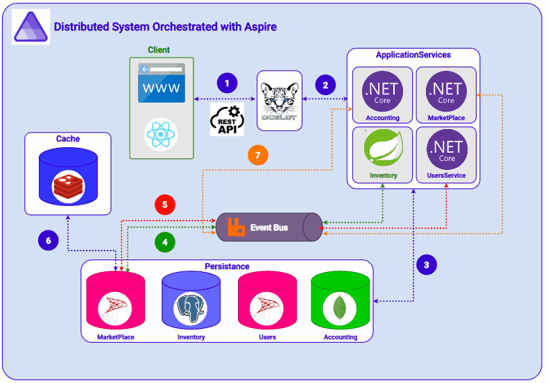
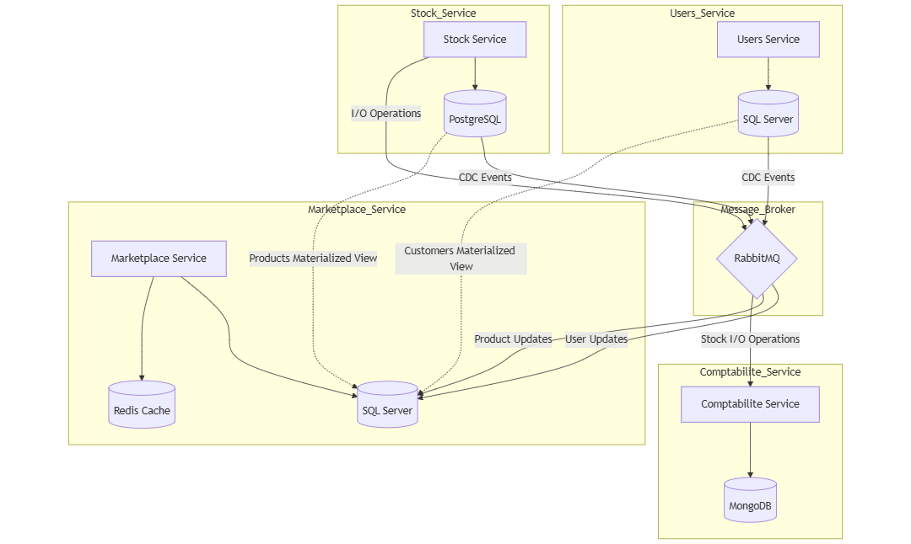

# Cloud-Native Solution for Inventory and Marketplace Integration

A modern, scalable solution that combines inventory management with marketplace functionality, built using cloud-native technologies and microservices architecture.

# 🚀 Features

- Microservices-based architecture
- Real-time inventory management
- Integrated Accounting Service
- Integrated marketplace platform
- Administrative dashboard
- Scalable cloud deployment
- Caching system for improved performance
- Media management with Cloudinary
- API Gateway for unified access

# 🛠 Tech Stack

## Backend

- .NET Aspire - Cloud-native application framework
- ASP.NET Core - Web API development
- Spring Boot - Web API development
- RabbitMQ - Message broker for service communication
- Ocelot - API Gateway

## Frontend

- React 18 - For both Marketplace and Dashboard UIs

## Databases

- SQL Server - For Users and Stock services
- PostgreSQL - For Marketplace service
- Redis - For caching
- MongoDb - For Accounting Service

## Cloud & DevOps

- Docker - Containerization
- Kubernetes - Container orchestration
- DigitalOcean - Cloud infrastructure
- GitHub - Version control and CI/CD

## Storage & Media

- Cloudinary - Media management and optimization

# 🏗 Architecture



The system is composed of several microservices:

- Users Service : Handles user management and authentication

- Marketplace Service : Manages marketplace listings and transactions

- Stock Service : Controls inventory and stock management

- Accounting Service : Record Every Operation Accounting bills

- Gateway : Routes and manages API requests using Ocelot

## 💾 Database Structure

Each service maintains its own database:

- Users Service → SQL Server
- Marketplace Service → PostgreSQL
- Stock Service → SQL Server
- Accounting Service → MongoDb
- Redis for caching frequently accessed data

## 🚀 Getting Started

### Prerequisites

- .NET 8.0 SDK
- Docker Desktop
- Node.js and npm
- Kubernetes cluster access
- Redis
- SQL Server
- PostgreSQL
- 21 OpenJDK

### Installation

Clone the repository

```
git clone https://github.com/oussamahdidou/microservices.git
```

### Marketplace Frontend

```
cd client/marketplace/web
npm install
```

### Dashboard Frontend

```
cd client/adminpanel/free-react-tailwind-admin-dashboard
npm install
```

### 🔧 Configuration

The application requires several environment variables to be set:

```
CLOUDINARY_API_KEY=your_api_key
CLOUDINARY_API_SECRET=your_api_secret
```

## Run The App

- Navigate to the aspire project

```
cd backend/infrastructure/Aspire.AppHost
```

- Restore project dependencies

```
dotnet restore
```

- Run All The project

```
dotnet run
```

# 👥 Contributors

- Oussama Hdidou
- Noura Aoujil


